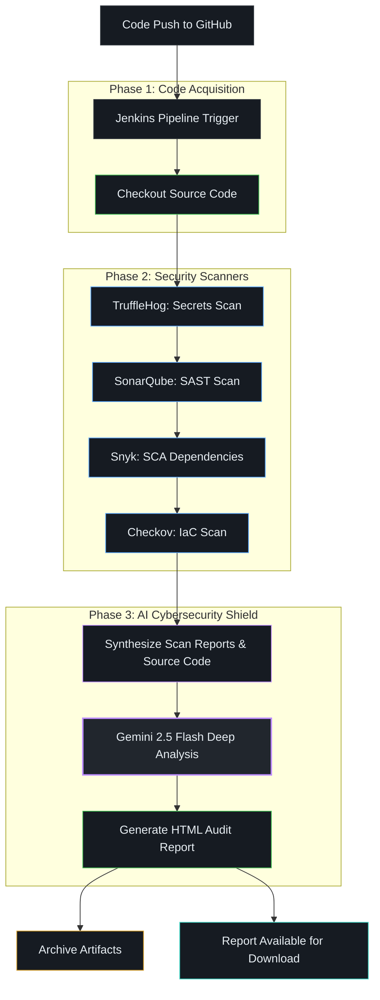

# 🛡️ AI-Enhanced DevSecOps Pipeline

## Overview
This repository contains a state-of-the-art DevSecOps pipeline orchestrated by Jenkins. It automatically scans code for secrets, vulnerabilities, open-source dependencies issues, and infrastructure misconfigurations.
The defining feature is the **AI Cybersecurity Shield** powered by Gemini 2.5 Flash, which acts as a read-only advisor, analyzing the output of all tools along with the source code to find hidden vulnerabilities that traditional tools miss.

### 🌊 Pipeline Flowchart



## 🛠️ The Technology Stack

1.  **CI/CD Engine:** Jenkins
2.  **Secrets Detection:** TruffleHog (`trufflehog`)
3.  **Static Application Security Testing (SAST):** SonarQube
4.  **Software Composition Analysis (SCA):** Snyk (`snyk`)
5.  **Infrastructure as Code (IaC) Scanning:** Checkov (`checkov`)
6.  **AI Audit Engine:** Google Gemini API (`gemini-2.5-flash`)
7.  **Report Generation:** Pure Python (No JS/CDN to bypass Jenkins constraints)

## ✨ The AI Security Report Fix Explained

When initially building this pipeline, we faced two major hurdles with the AI reporting:
1.  **Gemini API 404 Errors:** Google deprecated old experimental model names. The pipeline was fixed by migrating to the stable `gemini-2.5-flash` model endpoint on `v1beta`.
2.  **Jenkins CSP (Content Security Policy) Stripping Styles:** Jenkins aggressively blocks `<script>` tags, `<link>` CSS tags to external CDNs (like Tailwind or marked.js), and even `<style>` code blocks. When viewing HTML in Jenkins, it turns into unstyled black-and-white text.
    *   **The Solution:** The `generate_report.py` script was completely rewritten. It uses a custom Markdown-to-HTML parser in pure Python that manually attaches `style="..."` attributes to **every single HTML element** (100% Inline CSS).
    *   This completely bypasses Jenkins CSP constraints, allowing the dark-themed, colorful security report to render gorgeously straight off a local download without needing internet connectivity or external assets.

---

## 🚀 Setting Up on a Fresh PC (Local Installation)

If you need to replicate this entire DevSecOps environment on a fresh laptop, follow these exact steps.

### Step 1: System Prerequisites
Ensure you have the following installed on your machine:
*   [Docker Desktop](https://www.docker.com/products/docker-desktop/) or Docker Engine
*   [Python 3.9+](https://www.python.org/downloads/)
*   Git

### Step 2: Install Security Tools Locally Or on Jenkins Agent
The Jenkins pipeline expects the following CLI tools to be available in the path:
```bash
# macOS (using Homebrew)
brew tap trufflesecurity/trufflehog
brew install trufflehog
brew tap snyk/tap
brew install snyk
pip3 install checkov
```
*(If you are running Jenkins inside a Docker container, these tools must be installed inside the Jenkins container, or the Jenkins server must be connecting to an agent machine/node that has these tools installed).*

### Step 3: Run SonarQube Locally
Start SonarQube using Docker.
```bash
docker run -d --name sonarqube -p 3000:9000 --restart unless-stopped sonarqube:lts-community
```
1. Wait a few minutes for the server to spin up.
2. Visit `http://localhost:3000` in your browser.
3. Login with default credentials: `admin` / `admin` (it will ask you to change the password).
4. Go to **Administration -> Security -> Users -> Tokens**.
5. Generate a new token. **Save this token**, you will need it for Jenkins!
6. Create a new project manually inside SonarQube, name it `ZNf_Repair_and_Services` (note the exact project key, you may need to update the `sonar.projectKey` in the `Jenkinsfile` if you use a different one).

### Step 4: Run Jenkins Locally
Start Jenkins using Docker.
```bash
docker run -p 8080:8080 -p 50000:50000 -v jenkins_home:/var/jenkins_home jenkins/jenkins:lts
```
1. Look at the terminal output to copy the initial admin password.
2. Visit `http://localhost:8080`, paste the password, and select "Install suggested plugins".
3. Create your first admin user.
4. **Important**: Go to **Manage Jenkins -> Plugins -> Available Plugins**. Search for and install the **"SonarQube Scanner"** plugin. Restart Jenkins if needed.

### Step 5: Configure Jenkins Credentials & SonarQube Server
The pipeline relies on several credentials and server configurations.

1.  **Configure SonarQube Server in Jenkins:**
    *   Go to **Manage Jenkins -> System**.
    *   Scroll down to **SonarQube servers**. Click "Add SonarQube".
    *   Name: `SonarQube`
    *   Server URL: `http://host.docker.internal:3000` (Use this if Jenkins is in Docker and SonarQube is in another Docker container on Mac/Windows, otherwise use the actual IP).
    *   Server authentication token: Add a new "Secret text" credential containing the SonarQube token you generated in Step 3. Select it from the dropdown. Save.

2.  **Configure SonarQube Scanner Tool:**
    *   Go to **Manage Jenkins -> Tools**.
    *   Scroll down to **SonarQube Scanner**. Click "Add SonarQube Scanner".
    *   Name: `SonarScanner` (Must perfectly match the name in your Jenkinsfile: `def scannerHome = tool 'SonarScanner'`).
    *   Check "Install automatically". Save.

3.  **Add Sensitive Credentials:**
    Go to **Manage Jenkins -> Credentials -> System -> Global credentials -> Add Credentials**.
    Create the following "Secret text" credentials. **The ID field must match these exactly:**
    *   ID: `snyk-api-token` | Secret: *Your personal Snyk Token (from snyk.io)*
    *   ID: `gemini-api-key` | Secret: *Your Google AI Studio API Key*

### Step 6: Create the Pipeline Job
1. In Jenkins dashboard, click **New Item**.
2. Name it `znfrepair-secure-pipeline` and select **Pipeline**. Click OK.
3. Scroll down to the **Pipeline** section.
4. Definition: Select **Pipeline script from SCM**.
5. SCM: **Git**.
6. Repository URL: Enter your repo URL (e.g., `https://github.com/Rahul83100/znfrepairandservices.git`). Note: if it's a private repo, you must add and select Git credentials.
7. Branch Specifier: `*/secure-test` (or whatever branch your `Jenkinsfile` resides on).
8. Script Path: `Jenkinsfile` (Make sure this exactly matches where your file is in the repo).
9. Click **Save**.

### Step 7: Fix the Jenkins Container Missing Deps (If running Jenkins strictly in Docker)
If you ran Jenkins via Docker default image, it does not have `snyk`, `checkov`, `trufflehog`, or `python3` installed.
To fix this, log into the Jenkins container as root:
```bash
docker exec -u root -it <jenkins_container_id> bash
```
Then install the tools:
```bash
apt-get update
# Install Python
apt-get install -y python3 python3-pip
# Install Snyk
curl --compressed https://static.snyk.io/cli/latest/snyk-linux -o snyk
chmod +x ./snyk
mv ./snyk /usr/local/bin/
# Install Checkov
pip3 install checkov --break-system-packages
# Trufflehog install via script
curl -sSfL https://raw.githubusercontent.com/trufflesecurity/trufflehog/main/scripts/install.sh | sh -s -- -b /usr/local/bin
```

### Step 8: Trigger Build 🚀
Click **Build Now** on your Jenkins pipeline.
1. The pipeline will pull code.
2. It will run Trufflehog (fast pass for secrets).
3. It pushes data to your local SonarQube instance.
4. Snyk checks `package.json` / Python dependencies.
5. Checkov checks Terraforms/K8s/Dockerfiles.
6. The AI collects all JSON/TXT outputs from these steps.
7. Wait 1-2 minutes for Gemini to process the context.
8. The build finishes! 

Click on the **Build Number** (e.g., #1), look for **Build Artifacts** at the top, and click **`ai_security_audit.html`** to download your stunning AI Security Report!
