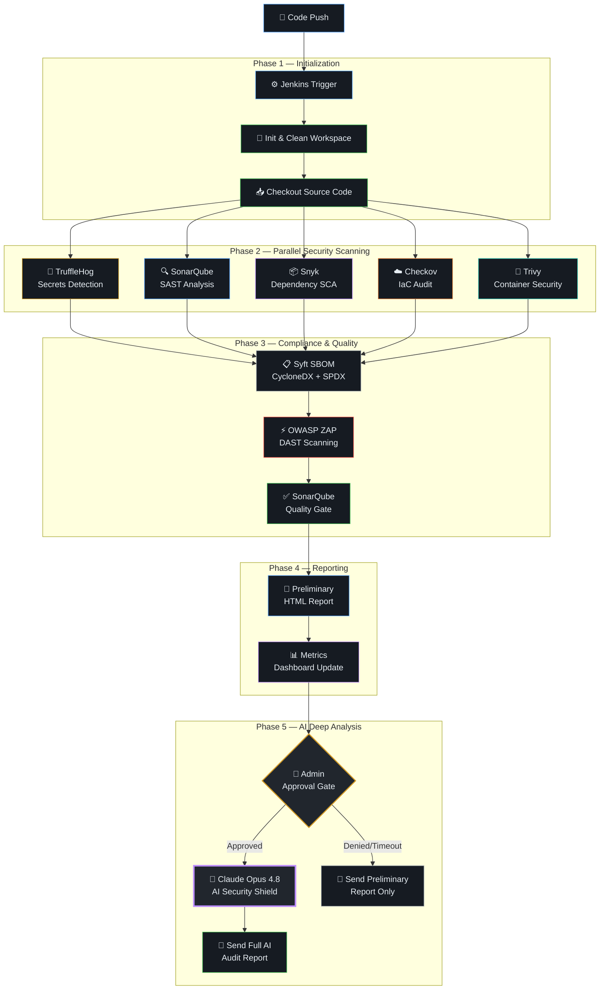
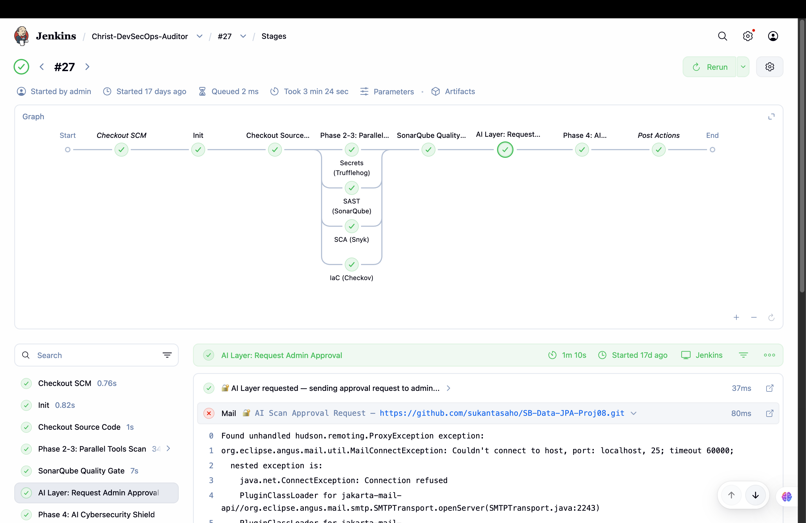
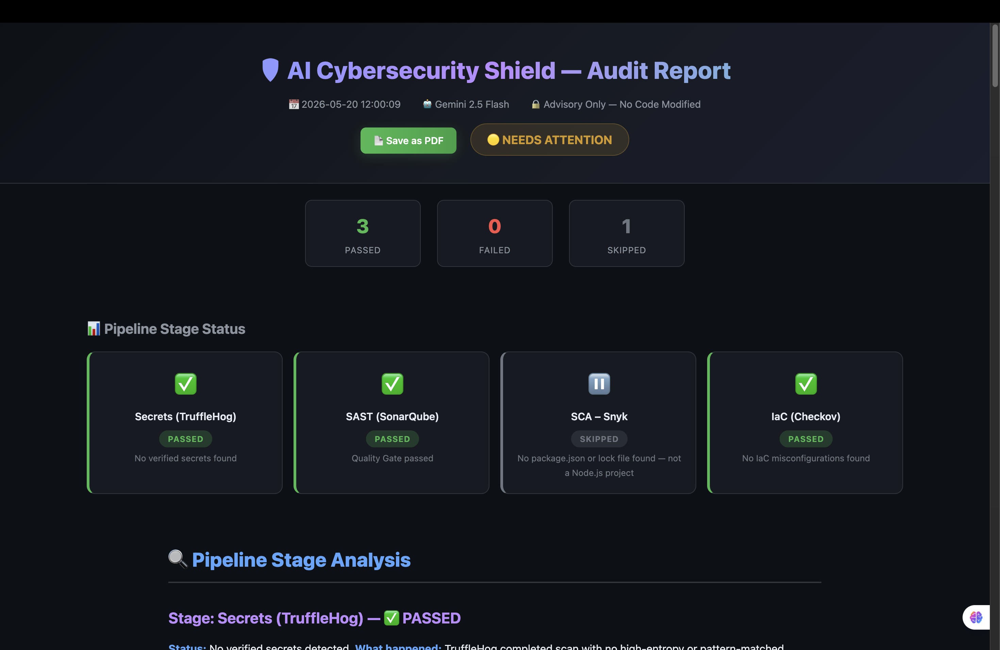
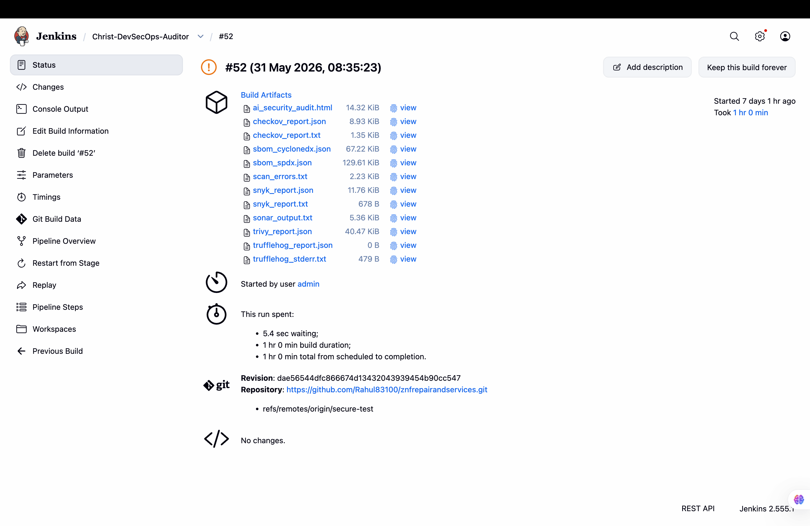
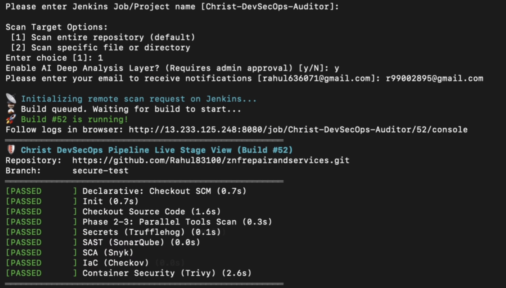
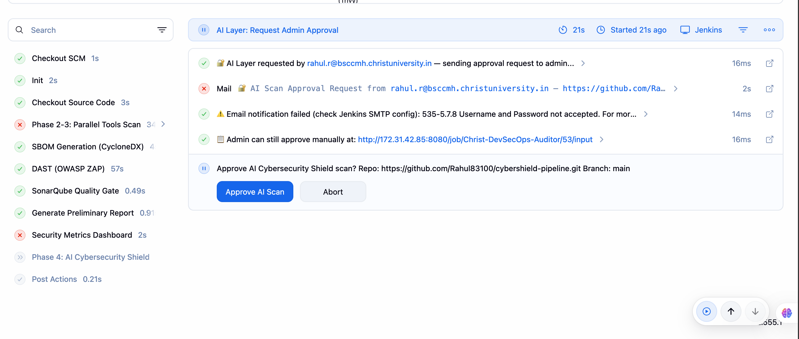
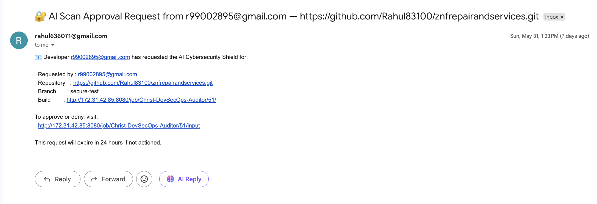

<div align="center">

# 🛡️ CyberShield Pipeline

### AI-Powered DevSecOps Security Auditing Engine

A production-ready, cloud-native automated DevSecOps pipeline running **13 security stages** across **8 enterprise scanners**, backstopped by **Claude Opus 4.8** for deep semantic vulnerability detection.

Automatically generates attack-flow diagrams, SBOM reports, and code remediation roadmaps — with zero manual steps.

[](https://www.jenkins.io/)
[](https://www.anthropic.com/)
[](https://python.org/)
[](https://docker.com/)
[](LICENSE)

---

[Features](#-features) · [Architecture](#-pipeline-architecture) · [Tech Stack](#-technology-stack) · [Installation](#-installation) · [CLI Tool](#-cli-scanner-cybershield-scan) · [Screenshots](#-screenshots) · [Security](#-security-architecture) · [Contributing](#contributing)

</div>

---

## 🎯 The Problem

> **83% of codebases contain known vulnerabilities.** Manual security reviews take weeks. Traditional static scanners catch rule-based syntax bugs, but completely miss complex **business logic flaws**, **cascading attack vectors**, and **software supply chain vulnerabilities**. By the time you find the breach, the damage is already done.

## 💡 The Solution

CyberShield Pipeline automates the entire security auditing lifecycle in a single Jenkins pipeline trigger. It runs 8 enterprise-grade scanners in parallel, generates a full Software Bill of Materials for regulatory compliance, and then deploys an AI-powered semantic analysis layer (Claude Opus 4.8) that finds hidden vulnerabilities no traditional tool can detect — producing a premium HTML audit report with attack-flow diagrams and code-level remediation roadmaps.

---

## ✨ Features

| Feature | Description |
|---------|-------------|
| 🔀 **Parallel Multi-Scanner Core** | 6 security scanners run simultaneously — secrets, SAST, SCA, IaC, container, and DAST |
| 📋 **SBOM Generation** | Automated Software Bill of Materials in CycloneDX + SPDX formats (US EO 14028 compliant) |
| 🧠 **AI Semantic Analysis** | Claude Opus 4.8 performs deep code analysis — finding business logic flaws, OWASP Top 10 patterns, and attack chains |
| 📊 **Executive Dashboard** | Real-time HTML dashboard with vulnerability trends, severity charts, and historical posture tracking |
| 📧 **Email Notifications** | Premium HTML audit report delivered directly to developer inboxes |
| 🖥️ **Terminal CLI Scanner** | `cybershield-scan` — trigger scans from any terminal with live stage progress |
| 🎯 **Targeted Path Scanning** | Audit specific files or directories without scanning the entire repository |
| 🔐 **Admin Approval Gate** | AI execution requires explicit admin authorization — protecting API costs and enforcing oversight |
| ✅ **Quality Gate** | SonarQube quality gate enforcement — fails builds that don't meet code quality thresholds |
| 🤖 **Zero-Hallucination AI** | Strict sentinel logic ensures the AI never fabricates findings — advisor-only mode, never modifies code |

---

## 🏗️ Pipeline Architecture



---

## 🛠️ Technology Stack

| Category | Tool | Purpose |
|----------|------|---------|
| **CI/CD Engine** | Jenkins | Pipeline orchestration, build automation, approval gates |
| **Secrets Detection** | TruffleHog | Filesystem entropy scanning for leaked API keys, passwords, and tokens |
| **SAST** | SonarQube | Static Application Security Testing — XSS, SQL injection, code smells, OWASP Top 10 |
| **SCA** | Snyk | Software Composition Analysis — scans npm/pip dependency trees for known CVEs |
| **IaC Scanning** | Checkov | Infrastructure-as-Code audit — Terraform, Dockerfile, Kubernetes misconfigurations |
| **Container Security** | Trivy | Docker image scanning for HIGH/CRITICAL CVEs in base images and layers |
| **DAST** | OWASP ZAP | Dynamic Application Security Testing — runtime attack simulation (SQLi, XSS, CSRF) |
| **SBOM Generation** | Syft | Software Bill of Materials in CycloneDX and SPDX formats (EO 14028 compliance) |
| **AI Analysis** | Claude Opus 4.8 (Anthropic) | Deep semantic vulnerability analysis, attack-flow mapping, remediation roadmaps |
| **Report Engine** | Python (Pure) | Custom Markdown-to-HTML renderer with 100% inline CSS (bypasses Jenkins CSP) |
| **Cloud Infrastructure** | AWS EC2 | Production hosting for Jenkins, SonarQube (Docker), and all scanning tools |

---

## 📸 Screenshots

> **Note:** Add your screenshots to `docs/screenshots/` and they will render here.

### Pipeline Stage View


### AI Security Audit Report  


### Executive Metrics Dashboard


### CLI Scanner in Action


### Admin Approval Gate


### Email Notification


---

## 🚀 Installation

### Prerequisites

| Requirement | Version |
|------------|---------|
| Docker | 20.10+ |
| Python | 3.9+ |
| Git | 2.x+ |
| Jenkins | 2.400+ LTS |

### Step 1: Install Security Tools

```bash
# macOS (Homebrew)
brew tap trufflesecurity/trufflehog && brew install trufflehog
brew tap snyk/tap && brew install snyk
pip3 install checkov

# Linux (Debian/Ubuntu)
curl -sSfL https://raw.githubusercontent.com/trufflesecurity/trufflehog/main/scripts/install.sh | sh -s -- -b /usr/local/bin
curl --compressed https://static.snyk.io/cli/latest/snyk-linux -o /usr/local/bin/snyk && chmod +x /usr/local/bin/snyk
pip3 install checkov
```

### Step 2: Start SonarQube

```bash
docker run -d --name sonarqube \
  -p 9000:9000 \
  --restart unless-stopped \
  sonarqube:lts-community
```

1. Visit `http://localhost:9000` — default login: `admin` / `admin`
2. Generate a user token: **Administration → Security → Users → Tokens**
3. Save the token for Jenkins configuration

### Step 3: Start Jenkins

```bash
docker run -d --name jenkins \
  -p 8080:8080 -p 50000:50000 \
  -v jenkins_home:/var/jenkins_home \
  jenkins/jenkins:lts
```

1. Get the initial admin password from container logs
2. Install suggested plugins + **SonarQube Scanner** plugin

### Step 4: Configure Jenkins Credentials

Navigate to **Manage Jenkins → Credentials → System → Global** and add:

| Credential ID | Type | Value |
|--------------|------|-------|
| `snyk-api-token` | Secret text | Your Snyk API token from [snyk.io](https://snyk.io) |
| `anthropic_api_key` | Secret text | Your Anthropic API key from [console.anthropic.com](https://console.anthropic.com) |

### Step 5: Configure SonarQube in Jenkins

1. **Manage Jenkins → System → SonarQube servers** → Add:
   - Name: `SonarQube`
   - URL: `http://host.docker.internal:9000`
   - Token: Add as Secret text credential
2. **Manage Jenkins → Tools → SonarQube Scanner** → Add:
   - Name: `SonarScanner`
   - Install automatically: ✅

### Step 6: Create Pipeline Job

1. **New Item** → Name: `CyberShield-Pipeline` → Type: **Pipeline**
2. **Pipeline** → Definition: `Pipeline script from SCM`
3. **SCM:** Git → Repository URL: `https://github.com/YOUR_USERNAME/cybershield-pipeline.git`
4. **Branch:** `*/main`
5. **Script Path:** `Jenkinsfile`
6. **Save** and click **Build Now** 🚀

---

## 🖥️ CLI Scanner (`cybershield-scan`)

CyberShield includes a terminal-based scanner that developers can use to trigger scans without touching the Jenkins UI.

### Setup

```bash
# Add to your PATH
chmod +x scripts/christ-scan
ln -s $(pwd)/scripts/christ-scan /usr/local/bin/cybershield-scan

# Configure Jenkins connection
export JENKINS_URL=http://your-jenkins-server:8080
```

### Usage

```bash
# Interactive mode — guided prompts
cybershield-scan

# Remote pipeline scan (full 8-tool + AI)
cybershield-scan --remote

# Local quick scan (TruffleHog + Checkov, offline)
cybershield-scan --local
```

### Features

- 🔐 **Secure Authentication** — Jenkins credentials stored locally in `~/.christ_scan_auth`
- 📡 **Live Stage Progress** — Real-time terminal view of all pipeline stages
- 📥 **Auto-Download** — Reports downloaded automatically on completion
- 🎯 **Targeted Scanning** — Scan specific files or directories
- 📧 **Email Integration** — Receive the AI audit report in your inbox

---

## 🔐 Security Architecture

CyberShield implements a multi-layered security model:

```
┌─────────────────────────────────────────────────────┐
│  Layer 1: Jenkins Authentication                     │
│  ├── Username + API Token (Basic Auth)               │
│  └── CSRF Crumb Protection                           │
├─────────────────────────────────────────────────────┤
│  Layer 2: Credential Isolation                       │
│  ├── API keys in Jenkins Credential Store            │
│  ├── Never exposed in build logs                     │
│  └── CLI uses local file (~/.christ_scan_auth)       │
├─────────────────────────────────────────────────────┤
│  Layer 3: Admin Approval Gate                        │
│  ├── submitter: 'admin' — only admin can approve     │
│  ├── 24-hour timeout auto-denial                     │
│  └── Developer email validation required             │
├─────────────────────────────────────────────────────┤
│  Layer 4: Responsible AI                             │
│  ├── Advisor-only mode — never modifies code         │
│  ├── Zero-hallucination sentinel logic               │
│  └── Structured prompt with strict output format     │
└─────────────────────────────────────────────────────┘
```

For details, see [SECURITY.md](SECURITY.md).

---

## 📁 Project Structure

```
cybershield-pipeline/
├── Jenkinsfile                  # Main pipeline — 13 stages, 1200+ lines
├── scripts/
│   ├── christ-scan              # CLI scanner tool (Python)
│   ├── anthropic_query.py       # Claude Opus 4.8 API integration
│   ├── generate_report.py       # Custom Markdown → HTML report engine
│   ├── update_dashboard.py      # Executive metrics dashboard generator
│   ├── ai_security_audit.sh     # AI analysis orchestration script
│   └── ai_analyze.sh            # Analysis helper script
├── sample-app/                  # Demo target application (intentionally vulnerable)
│   ├── app.js                   # Express.js server
│   ├── index.html               # Frontend
│   ├── main.tf                  # Terraform config (for IaC scanning)
│   └── README.md
├── docs/
│   └── screenshots/             # Pipeline screenshots for documentation
├── .github/
│   └── ISSUE_TEMPLATE/
│       ├── bug_report.md
│       └── feature_request.md
├── .gitignore
├── .trufflehog-ignore
├── LICENSE
├── SECURITY.md
├── CONTRIBUTING.md
└── README.md
```

---

## 🧩 How the AI Report Engine Works

One of the biggest technical challenges was rendering styled HTML reports inside Jenkins, which enforces a strict **Content Security Policy (CSP)** that strips all `<style>`, `<script>`, and `<link>` tags.

**The Solution:** `generate_report.py` is a custom, pure-Python Markdown-to-HTML renderer that applies `style="..."` attributes to **every single HTML element** (100% inline CSS). This completely bypasses Jenkins CSP constraints, producing a dark-themed, fully-styled security report that renders beautifully both inside Jenkins and when downloaded locally — with zero external dependencies.

---

## 🗺️ Roadmap

- [ ] **RAG-Enhanced AI** — Index historical scan results for cross-reference analysis
- [ ] **Compliance Mapping** — Map findings to OWASP Top 10, NIST 800-53, SOC 2
- [ ] **GitOps Auto-Remediation** — Auto-create PRs with AI-suggested code fixes
- [ ] **VS Code Extension** — Inline vulnerability diagnostics in the IDE
- [ ] **Multi-Tenant Support** — Isolated scan namespaces with role-based access

---

## 🤝 Contributing

Contributions are welcome! Please read [CONTRIBUTING.md](CONTRIBUTING.md) for guidelines.

## 📄 License

This project is licensed under the MIT License — see the [LICENSE](LICENSE) file for details.

---

<div align="center">

**Built with 🛡️ by [Rahul R](https://github.com/Rahul83100)**

*CyberShield Pipeline — Because security shouldn't be an afterthought.*

</div>
